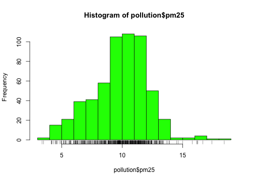
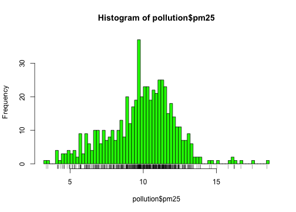
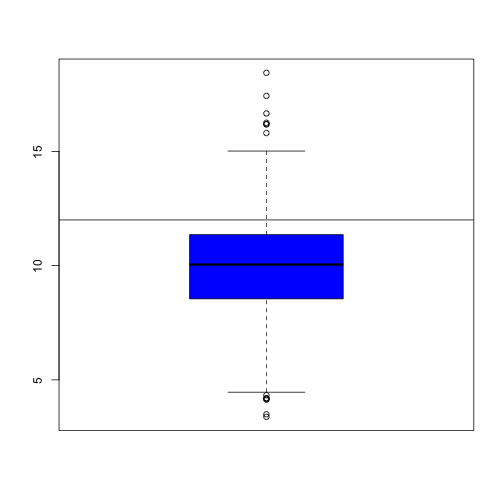
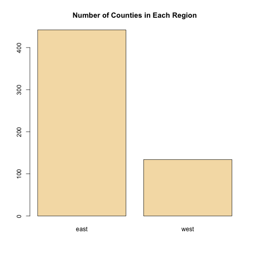
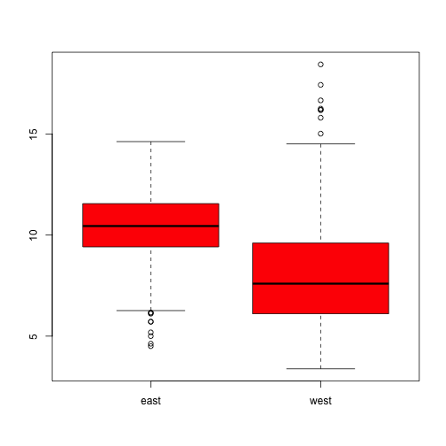
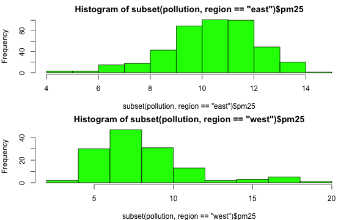
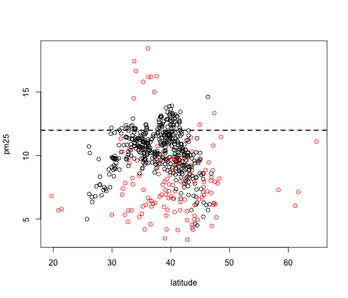

## Why do we use graphs in data analysis? 

* To understand data properties
* To find patterns in data
* To suggest modeling strategies
* To "debug" analyses
* To communicate results

---

## Exploratory graphs

* <redtext>To understand data properties</redtext>
* <redtext>To find patterns in data</redtext>
* <redtext>To suggest modeling strategies</redtext>
* <redtext>To "debug" analyses</redtext>
* To communicate results

---

## Characteristics of exploratory graphs

* They are made quickly
* A large number are made
* The goal is for personal understanding
* Axes/legends are generally cleaned up (later)
* Color/size are primarily used for information

---

## Air Pollution in the United States

* The U.S. Environmental Protection Agency (EPA) sets national ambient
  air quality standards for outdoor air pollution

  * [U.S. National Ambient Air Quality Standards](http://www.epa.gov/air/criteria.html)

* For fine particle pollution (PM2.5), the "annual mean, averaged over
  3 years" cannot exceed $12~\mu g/m^3$.

* Data on daily PM2.5 are available from the U.S. EPA web site

  - [EPA Air Quality System](http://www.epa.gov/ttn/airs/airsaqs/detaildata/downloadaqsdata.htm)

* **Question**: Are there any counties in the U.S. that exceed that
  national standard for fine particle pollution?

---

## Data

Annual average PM2.5 averaged over the period 2008 through 2010


```r
pollution <- read.csv("data/avgpm25.csv", colClasses = c("numeric", "character", 
    "factor", "numeric", "numeric"))
head(pollution)
```

```
##     pm25  fips region longitude latitude
## 1  9.771 01003   east    -87.75    30.59
## 2  9.994 01027   east    -85.84    33.27
## 3 10.689 01033   east    -87.73    34.73
## 4 11.337 01049   east    -85.80    34.46
## 5 12.120 01055   east    -86.03    34.02
## 6 10.828 01069   east    -85.35    31.19
```


Do any counties exceed the standard of $12~\mu g/m^3$?

---

## Simple Summaries of Data


One dimension

* Five-number summary
* Boxplots
* Histograms
* Density plot
* Barplot

---

## Five Number Summary


```r
summary(pollution$pm25)
```

```
##    Min. 1st Qu.  Median    Mean 3rd Qu.    Max. 
##    3.38    8.55   10.00    9.84   11.40   18.40
```


---

## Boxplot


```r
boxplot(pollution$pm25, col = "blue")
```

 


---

## Histogram


```r
hist(pollution$pm25, col = "green")
```

 


---

## Histogram


```r
hist(pollution$pm25, col = "green")
rug(pollution$pm25)
```

 


---

## Histogram


```r
hist(pollution$pm25, col = "green", breaks = 100)
rug(pollution$pm25)
```

 


---

## Overlaying Features


```r
boxplot(pollution$pm25, col = "blue")
abline(h = 12)
```

 


---

## Overlaying Features


```r
hist(pollution$pm25, col = "green")
abline(v = 12, lwd = 2)
abline(v = median(pollution$pm25), col = "magenta", lwd = 4)
```

 


---

## Barplot


```r
barplot(table(pollution$region), col = "wheat", main = "Number of Counties in Each Region")
```

 


---

## Simple Summaries of Data

Two dimensions

* Multiple/overlayed 1-D plots (Lattice/ggplot2)
* Scatterplots
* Smooth scatterplots

$> 2$ dimensions

* Overlayed/multiple 2-D plots; coplots
* Use color, size, shape to add dimensions
* Spinning plots
* Actual 3-D plots (not that useful)


---

## Multiple Boxplots


```r
boxplot(pm25 ~ region, data = pollution, col = "red")
```

 


---

## Multiple Histograms


```r
par(mfrow = c(2, 1), mar = c(4, 4, 2, 1))
hist(subset(pollution, region == "east")$pm25, col = "green")
hist(subset(pollution, region == "west")$pm25, col = "green")
```

 


---

## Scatterplot


```r
with(pollution, plot(latitude, pm25))
abline(h = 12, lwd = 2, lty = 2)
```

 


---

## Scatterplot - Using Color


```r
with(pollution, plot(latitude, pm25, col = region))
abline(h = 12, lwd = 2, lty = 2)
```

 


---

## Multiple Scatterplots


```r
par(mfrow = c(1, 2), mar = c(5, 4, 2, 1))
with(subset(pollution, region == "west"), plot(latitude, pm25, main = "West"))
with(subset(pollution, region == "east"), plot(latitude, pm25, main = "East"))
```

 


---

## Summary

* Exploratory plots are "quick and dirty"

* Let you summarize the data (usually graphically) and highlight any broad features

* Explore basic questions and hypotheses (and perhaps rule them out)

* Suggest modeling strategies for the "next step"

---


## Further resources

* [R Graph Gallery](http://gallery.r-enthusiasts.com/)
* [R Bloggers](http://www.r-bloggers.com/)


